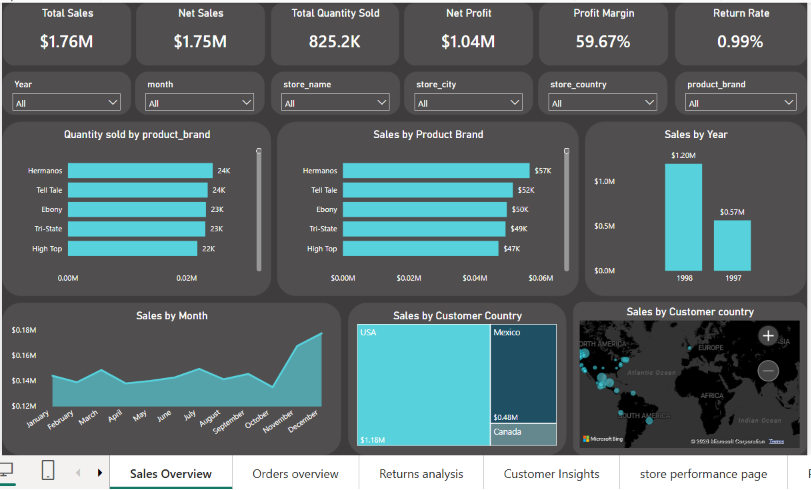
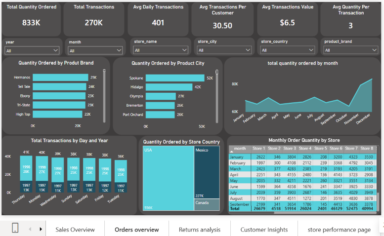
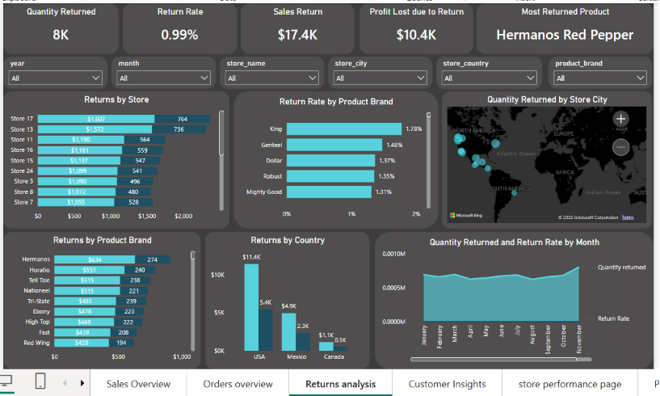
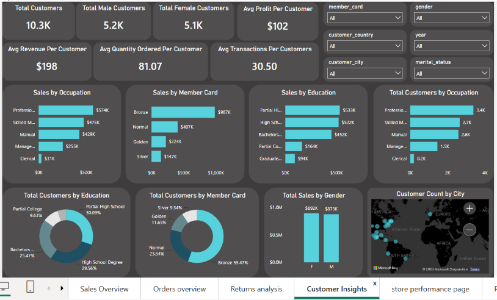
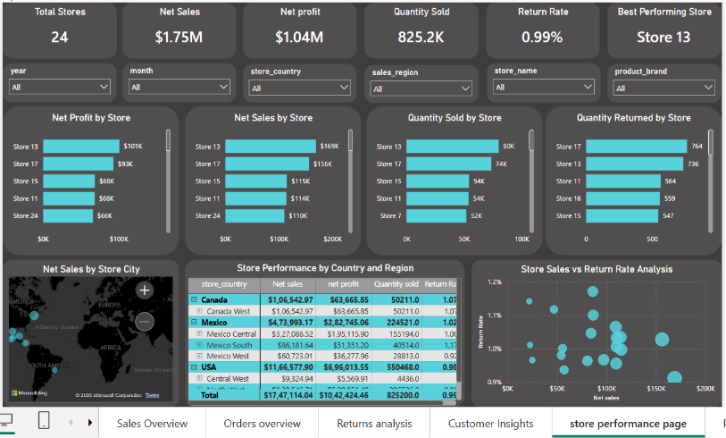
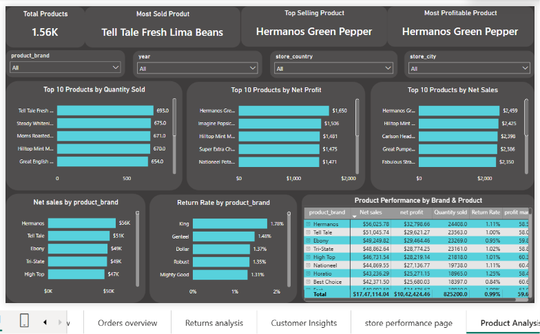

# 📊 Maven Market Power BI Dashboard

## 📌 Project Overview

This project is an interactive Business Intelligence dashboard built in **Microsoft Power BI** using the Maven Market dataset. It provides insights into sales performance, customer behavior, orders, product returns, store performance, and product analysis through interactive visualizations and KPIs.

---

## 🎯 Business Objective

The dashboard helps analyze:

- Sales and profitability
- Order trends
- Product returns
- Customer insights
- Store performance
- Product performance

---

## 🛠️ Tools & Skills Used

- Microsoft Power BI
- Power Query
- DAX
- Data Modeling
- Data Cleaning
- Data Visualization

---

## 📊 Dashboard Pages

- 📈 Sales Overview
- 🛒 Orders Overview
- 🔄 Returns Analysis
- 👥 Customer Insights
- 🏪 Store Performance
- 📦 Product Analysis

---

## 📸 Dashboard Preview

| Sales Overview | Orders Overview |
|----------------|-----------------|
|  |  |

| Returns Analysis | Customer Insights |
|------------------|-------------------|
|  |  |

| Store Performance | Product Analysis |
|-------------------|------------------|
|  |  |

---

## 📈 Key Highlights

- Built an interactive multi-page Power BI dashboard.
- Created KPIs for Sales, Profit, Returns, Customers, Stores, and Products.
- Used Power Query for data transformation.
- Used DAX measures for business calculations.
- Designed an interactive dashboard with slicers and drill-down analysis.

---

## 📂 Repository Contents

- Maven Market Analysis.pbix
- Dashboard Screenshots
- README.md

---

## 👨‍💻 Author

**Abhay B H**

Aspiring Data Analyst | Power BI | SQL | Excel

- GitHub: [Abhaybh-Analytics](https://github.com/Abhaybh-Analytics)
- LinkedIn: [Abhay B H](https://www.linkedin.com/in/abhay-b-h/)
